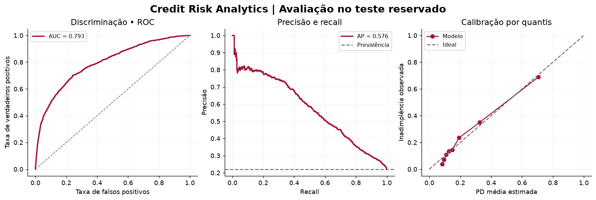
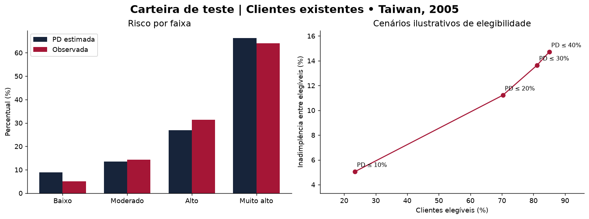
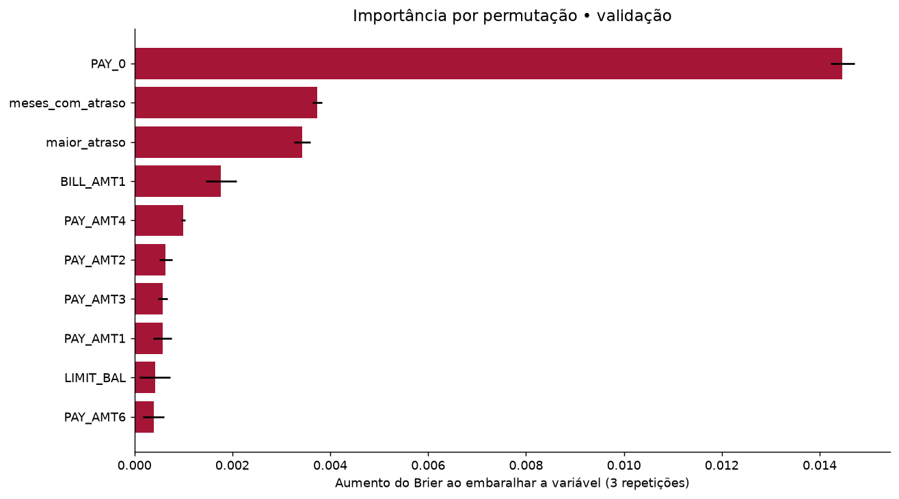

# Credit Risk Analytics — Modelagem de Inadimplência

Projeto autoral educacional de **risco comportamental de crédito**, desenvolvido com **Python, SQL e Machine Learning**, com painel interativo local e evidências geradas pela execução.

O trabalho compara modelos que estimam inadimplência no mês seguinte para clientes que já possuem cartão de crédito. Também explora faixas de risco e cenários ilustrativos de elegibilidade.

Mantém a organização dos projetos educacionais anteriores do autor, mas **não corresponde a um desafio da DIO** e não possui vínculo institucional com o Bradesco.

## Problema de negócio

Como o histórico recente de pagamentos ajuda a estimar inadimplência, e como diferentes cortes de probabilidade alteram o tamanho e o risco do grupo elegível?

A análise se refere a clientes existentes. Não é um modelo validado de concessão para novos clientes, nem demonstra o efeito causal de uma política.

## Objetivo

Conectar preparação de dados, avaliação de probabilidades, interpretação e comunicação de resultados em um experimento reproduzível. O foco é demonstrar raciocínio de negócio bancário e disciplina de validação.

## Dados utilizados

- Base **Default of Credit Card Clients**, disponibilizada pela UCI;
- 30.000 registros de clientes de Taiwan;
- Histórico de abril a setembro de 2005 e desfecho no mês seguinte;
- Variável-alvo binária fornecida pela fonte: inadimplência no próximo mês;
- Valores monetários em **novos dólares taiwaneses (NT$)**, sem conversão para reais;
- Licença dos dados: **CC BY 4.0**.

Fonte: Yeh, I. (2009). *Default of Credit Card Clients*. UCI Machine Learning Repository. [DOI: 10.24432/C55S3H](https://doi.org/10.24432/C55S3H).

O download é feito da UCI na primeira execução. O arquivo original permanece fora do Git e seu SHA-256 é registrado no relatório para rastreabilidade. Não são utilizados dados internos do empregador.

## Arquitetura


## Metodologia

1. Validação de esquema, IDs, valores ausentes, limites e valores numéricos.
2. Construção de atributos financeiros e comportamentais observáveis antes do desfecho.
3. Exclusão de ID, sexo, idade, escolaridade e estado civil das entradas do modelo.
4. Divisão aproximada de 60%/20%/20% em treino, validação e teste, agrupando entradas idênticas para evitar vazamento entre conjuntos.
5. Comparação de referência de prevalência, Regressão Logística e XGBoost calibrado.
6. Ajuste do preparo somente no treino; calibração sigmoide do XGBoost com três partições internas, também separadas por grupos.
7. Seleção do modelo pelo menor **Brier** na validação.
8. Escolha do limiar de alerta pelo maior F1 na validação, em uma grade definida no código.
9. Avaliação final do modelo selecionado no teste reservado, sem reajuste pelos resultados do teste.
10. Geração de consultas SQL, cenários, gráficos e painel local.

A divisão é **aleatória por grupos, não temporal**. A base é uma fotografia histórica única; a presença de seis meses de atributos não fornece seis safras independentes.

Os parâmetros dos modelos estão definidos em `src/train.py`; não foi feita busca extensiva. Não foi aplicado SMOTE, undersampling ou peso de classe, preservando a prevalência observada no ajuste das probabilidades.

## Modelos e métricas

| Modelo | Papel |
|---|---|
| Referência de prevalência | Probabilidade constante estimada no treino. |
| Regressão Logística | Referência linear com padronização e codificação categórica dos estados de pagamento. |
| XGBoost calibrado | Modelo de árvores com calibração sigmoide interna ao treino. |

São reportados ROC AUC, Average Precision (AP), KS, Gini, Brier, log loss, precisão, recall, F1 e matriz de confusão. AP não é tratada como integração trapezoidal da curva precisão-recall.

**O limiar de alerta é diferente dos cortes dos cenários.** O primeiro define a classificação usada na matriz de confusão; os cortes de 10%, 20%, 30% e 40% definem grupos de elegibilidade ilustrativos, sem otimização no teste.

## Resultados da execução

O XGBoost calibrado foi selecionado pelo menor Brier na validação. Na execução registrada, o teste reservado apresentou:

| Indicador | Resultado |
|---|---:|
| Clientes no teste | 5.998 |
| Inadimplentes no teste | 1.326 |
| ROC AUC | 0,7934 |
| Average Precision | 0,5757 |
| Brier | 0,1318 |
| KS | 45,87% |
| Limiar de alerta escolhido na validação | 0,255 |

No cenário ilustrativo de PD até 20%, 4.216 clientes foram elegíveis (70,29%), com inadimplência observada de 11,22% nesse grupo. Esse resultado é retrospectivo e não comprova rentabilidade nem validade para novos clientes.

Consulte o [relatório de resultados](reports/resultados.md), gerado a partir do experimento, e o [registro completo de parâmetros, versões e métricas](reports/resumo.json).





## Explicabilidade

A importância por permutação foi medida **na validação**, pelo aumento do Brier após embaralhar uma variável, com três repetições. Variáveis correlacionadas podem compartilhar importância; o resultado não demonstra causalidade e não constitui justificativa individual de recusa.



## Painel e SQL

O arquivo [reports/painel.html](reports/painel.html) apresenta métricas, gráficos e um seletor dos quatro cenários. Abra-o localmente no navegador; a interface funciona sem serviço externo.

O banco SQLite é gerado em `artifacts/carteira.db`. A consulta [sql/indicadores.sql](sql/indicadores.sql) calcula contagem, inadimplência, PD média e limite médio por faixa. O resultado está em [reports/faixas_risco.csv](reports/faixas_risco.csv).

**O painel implementado é HTML.** A pasta [powerbi](powerbi/README.md) contém o roteiro de importação e as medidas DAX para uma evolução no Power BI; não há arquivo `.pbix` nem execução no Power BI nesta versão.

## Organização

```text
credit-risk-analytics/
├── README.md
├── requirements.txt
├── requirements-lock.txt
├── src/                 # Dados, métricas, treino, relatórios e inferência
├── tests/               # Contratos, limites e proteção contra vazamento
├── sql/                 # Consultas executadas em SQLite
├── docs/                # Metodologia, dicionário e modelo
├── powerbi/             # Roteiro e medidas; integração ainda não executada
├── examples/            # Entrada sintética para inferência
├── data/raw/            # Origem baixada, fora do Git
├── data/processed/      # Partições e previsões, fora do Git
├── artifacts/           # Modelo e banco local, fora do Git
├── reports/             # Métricas, agregados e painel HTML
└── evidencias/          # Gráficos da execução real
```

## Como executar no Windows

Pré-requisitos: **Python 3.12** e internet para instalar as bibliotecas e baixar os dados na primeira execução. Abra o PowerShell na pasta do projeto.

```powershell
python -m venv .venv
.\.venv\Scripts\python.exe -m pip install -r requirements-lock.txt
.\.venv\Scripts\python.exe -m unittest discover -s tests -v
.\.venv\Scripts\python.exe -m src.train
Start-Process .\reports\painel.html
```

No Linux/macOS, use `.venv/bin/python` no lugar de `.venv\Scripts\python.exe`. `requirements.txt` fixa as dependências diretas; `requirements-lock.txt` registra todo o ambiente usado na execução.

A primeira execução precisa acessar a UCI. Execuções seguintes reutilizam o ZIP baixado e regeneram relatórios, banco e modelo. O download fica em `data/raw/uci_credit.zip`.

### Avaliar um exemplo sintético

Depois do treinamento:

```powershell
.\.venv\Scripts\python.exe -m src.predict --input examples/cliente_sintetico.csv --output artifacts/previsao_exemplo.csv
```

O exemplo é fictício e serve para verificar a inferência. A previsão não possui validade comercial. Carregue apenas o arquivo de modelo gerado localmente por este projeto: arquivos `joblib` de terceiros podem executar código.

## Evidências e verificações

- Gráficos produzidos pelo código, sem métricas ilustrativas;
- CSVs de comparação, cenários, faixas e importância;
- JSON com fonte, hash, partições e versões;
- Testes de contrato dos dados, grupos disjuntos, métricas e limites dos cenários;
- [Registro da verificação local](reports/verificacao.txt).

## Limitações

- Base histórica de Taiwan; não representa clientes atuais do Brasil.
- Desfecho de um mês fornecido pela fonte; não equivale a PD de 12 meses ou definição regulatória brasileira de default.
- Ausência de avaliação temporal, intervalos de confiança e validação externa.
- Não há acompanhamento de safras, recuperação ou migração entre atrasos.
- Exclusão de atributos demográficos não elimina vieses indiretos; não foi realizada auditoria de equidade.
- PSI entre validação e teste mede diferença entre amostras da mesma fotografia, não deriva temporal de produção.
- Sem receita, LGD ou exposição em default; não são calculadas perda esperada, rentabilidade ou provisões.
- Limite de cartão não é saldo devedor, valor solicitado ou valor desembolsado.
- Faixas de risco e cortes de elegibilidade são escolhas educacionais.
- Não há API, integração com CrediPolicy, implantação em Azure ou painel Power BI executado nesta versão.

## Aprendizados e próximas evoluções

O experimento mostra por que qualidade de probabilidades, separação de dados e interpretação de negócio precisam acompanhar as métricas de classificação.

Evoluções possíveis: concluir o painel Power BI, obter base longitudinal apropriada para validação temporal, investigar estabilidade e equidade, adicionar explicações locais e integrar o modelo ao CrediPolicy respeitando o contrato de entrada e a diferença entre score e PD.

## Autor

**Antony Kennedy Ribeiro de Araújo**

Projeto autoral desenvolvido com apoio de IA na implementação e documentação. Os resultados registrados foram obtidos pela execução local. A compreensão e a defesa das decisões metodológicas fazem parte do estudo do autor.
